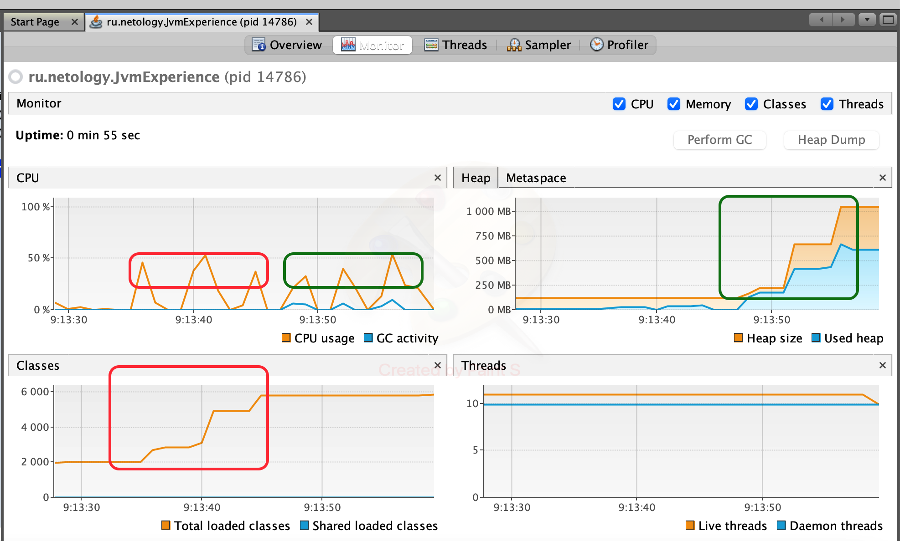

## Графики работы программы

## Вывод программы
```
09:13:35.310615: loading io.vertx
09:13:36.058881: loaded 529 classes
09:13:39.077088: loading io.netty
09:13:40.955662: loaded 2117 classes
09:13:43.959694: loading org.springframework
09:13:44.662238: loaded 869 classes
09:13:47.665112: now see heap
09:13:47.665826: creating 5000000 objects
09:13:48.341703: created
09:13:51.343888: creating 5000000 objects
09:13:51.816789: created
09:13:54.914117: creating 5000000 objects
09:13:55.801351: created
```
## Анализ графика CPU
1. Красным прямоугольником отмечены пики загрузки классов, что соответсвует строкам 1-6 в выоде программы. 3 блока загрузки классов - 3 пика.
2. Зеленым прямоугольником отмечены пики создания объектов, что соответсвует строкам 8-13 в выоде программы. 3 блока создания объектов - 3 пика.
## Анализ графика Heap
1. В первую часть выполнения программы (строки 1-6) куча не увеличивается, так как не происходит создание объектов.
2. Во вторую часть выполнения программы (строки 8-13) куча резко разрастается, так как происходит создание относительно большого количества объектов. Что соответсвует "зеленым" пикам CPU.
## Анализ графика Classes
1. В первую часть выполнения программы (строки 1-6) наблюдаем резкий рост загрузки классов. Что соответсвует "красным" пикам CPU.
2. Во вторую часть выполнения программы (строки 8-13) график загрузки классов остается стабильным, так как новые классы не подгружаются.
## Анализ графика Threads
График говорит о том, что программа выполнялась в один поток и была завершена в районе 09:14:00, что соответсвует логу программы.
